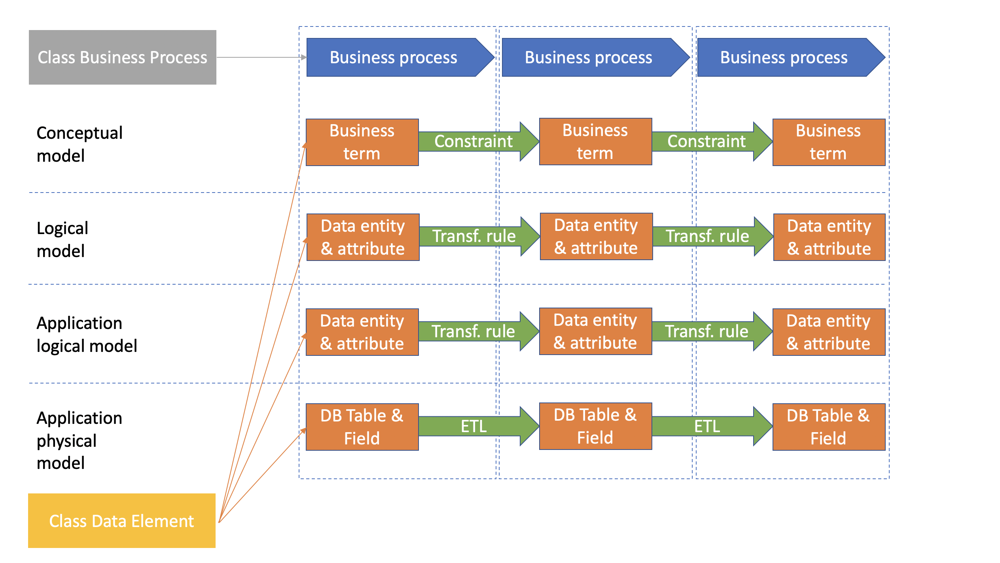

# Data Linage Master
Load, store, explore and analyze your data lineages with binding to business processes. Product provides basic components to implement the data managment viewpoint, such as:
* **data element** themselves form the key component of data linage. It can be specified at levels of abstraction and details (*conceptual* - data elements are presented in the form of terms and related constraints; *logical, application-related:* - data entities & attributes of a specific database and related data transformation rules; *logical, not application related* - data entities & attributes and related data transformation rules; *physical* - tables & columns & related ETLs(Extract, Transform, Load))
* **business process** ensures a set of activities related to data processing.

The top-level organization of the main components is shown in the figure below.

 